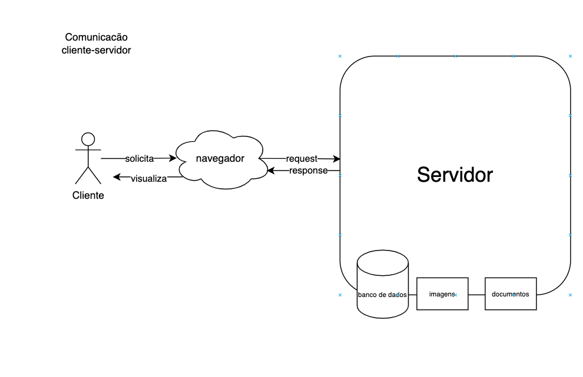
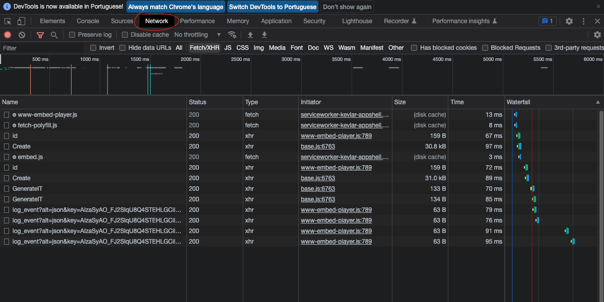

<h1 align="center">
  
</h1>

# Tema da Aula

Turma Online 19 - Todas em Tech  | Back-end | Semana 7 | 2022 | Beatriz Ramerindo

### Instruções
Antes de começar, vamos organizar nosso setup.
1. Fork esse repositório 

2. Clone o fork na sua máquina (Para isso basta abrir o seu terminal e digitar

```
$ git clone https://github.com/reprograma/on19-tet-s6-api-I.git
```

3. Entre na pasta do seu repositório (Para isso basta abrir o seu terminal e digitar

```
$ cd on19-tet-s6-api-I
```


### Resumo
O que veremos na aula de hoje?
> [Introdução ao HTTP](#introdução-ao-http)

> [Verbos HTTP](#verbos-http)

> [Status Code](#tema3)

> [Request](#request)

> [Request](#response)

> [Json](#json)

> [Introdução ao NodeJs](#introdução-ao-nodejs)


## Apresentação

### Monitoras

### Professora

Meu nome é Beatriz Ramerindo, podem me chamar de Bea, fui da primeira turma do Todas Em Tech online(on 11) e tenho um ano como professora aqui na Reprograma, atuo como Eng de Software numa plataforma de Lojas Virtuais a Nuvemshop, no meu dia-a-dia trabalho com desenvolvimento de APIs com NodeJs com typescript e javascript, também já trabalhei com desenvolvimento com  Spring Boot com Koltin


## Recadinhos

> Fiquem avontade para tirar dúvidas.

> Bebam muita agua, afinal é melhor uma pedra no caminho que nos rins

> Se possivel e quem se sentir confortável, podem abrir a camera

### Introdução ao HTTP

O HTTP desempenha um papel crucial no funcionamento da web e na relação cliente-servidor.

HyperText Transfer Protocol(HTTP), como o nome sugere, é um protocolo, um conjunto de regras que o servidor precisa seguir para transmitir todos os tipos de arquivos como imagens, texto, áudio, vídeo e outros tipos pela rede mundial de computadores.




Um exemplo disso é quando fazemos uma pesquisa numa loja, ao pesquisa-mos um produto, o navegador transforma o que o usuario solicita em uma requisição ([REQUEST](#request)) geralmente HTTP ( também conhecida como REST) que é a forma que o servidor que contém esses dados entende, o servidor processa a requisição, busca os recursos em sua base e constroi um resultado ([RESPONSE](#response)) e a devolve para o navegador, com um [status code](#http-status-code) que é responsável por definir se a operação foi um sucesso ou se deu algum tipo de erro e um payload (que são as informações solicitadas). O navegador converte essas informações de forma amigável para o usuário.

### HTTP métodos


Portanto, um cliente faz uma solicitação ao servidor, como o servidor saberia qual operação executar?

O HTTP usa métodos para informar ao servidor quais ações precisam ser realizadas quando o cliente envia uma solicitação. Também é chamado de *verbos HTTP*. Cada um desses métodos executa a operação necessária e retorna sucesso ou falha na sua conclusão.


 

Os métodos HTTP mais usados são: **GET**, **POST**, **PUT**, **PATCH** e **DELETE**.

Existem alguns outros também, como HEAD, OPTIONS, TRACE. Vamos entender o que os quatro métodos amplamente usados fazem:

 

| Verbo | Ação |
| ------ | ------ |
| GET |As solicitações GET são somente leitura, ler os dados, recuperá-los e devolvê-los ao cliente e fornece o recurso necessário sem nenhuma modificação. |
| POST |As solicitações POST são usadas para criar ou adicionar um novo item ao URL solicitado. Por exemplo, criar uma nova conta ou postar um novo blog, artigos no medium. Com base no seu URL, ele posta os dados em um local específico. Uma vez feito isso, ele responde com o código de status 201 (CREATED), junto com o link de localização dos dados postados. |
| PUT| As solicitações PUT são usadas para modificar ou substituir os dados atuais pelos dados solicitados. Por exemplo, alterar a senha em um site. Ele também pode ser usado para criar um novo item como o POST, mas o POST é mais apropriado para esse propósito. |
| PATCH| As solicitações PATCH são usadas para atualizar parcialmente os dados atuais pelos dados solicitados. Por exemplo, alterar a senha em um site. Ele também pode ser usado para criar um novo item como o POST, mas o POST é mais apropriado para esse propósito. |
| DELETE | A solicitação DELETE é usada para excluir todos os dados do local de destino solicitado pelo cliente. É uma operação arriscada porque, uma vez excluída, não pode ser recuperada novamente. |


 


 
 Mais informações sobre métodos [aqui](https://developer.mozilla.org/pt-BR/docs/Web/HTTP/Methods).

### HTTP Status Code (Código de status)


>Portanto, um cliente faz uma solicitação ao servidor, como o cliente saberia sobre o status da solicitação?


Os código de status nos permitem saber se a solicitação que fizemos ao servidor foi um sucesso ou uma falha ou algo intermediário.

 

Eles são divididos em **5 grupos**:

 

* 1xx - Informativo: O servidor não concluiu totalmente a solicitação, ainda está pensando e em fase de transição

* 2xx - Bem-sucedido: O servidor concluiu a solicitação com sucesso

* 3xx - Redirecionamentos: este bloqueio é para redirecionamentos, significa que você solicitou um endereço, mas foi enviado para outro lugar

* 4xx - Erros do cliente: há algum erro da sua parte

* 5xx - Erros do servidor: há algum erro no lado do servidor.


> Para as maes de CATs [aqui <](https://http.cat/)

> Para as maes de DOGs [aqui <](https://httpstatusdogs.com)


Mais informações sobre status code [aqui](https://developer.mozilla.org/pt-BR/docs/Web/HTTP/Status).


#### Request
O navegador por meio de uma interface visual, processa as informações que o cliente preenche e cria uma REQUEST e um Verbo HTTP indicando que tipo de solicitação será.

> Como a request é criada pelo navegador depende da ação do cliente.

#### Response
O servidor processa a requisicao, caso não seja possivel processa-la, ele retorna um erro, em caso de sucesso, ele retorna um payload contendo as informações solicitadas ou inseridas.
 

Você pode ver o escopo das solicitações HTTP acessando as ferramentas de desenvolvedor que o navegador disponibiliza.

 



 [Vamos ver isso na prática?](https://medium.com/estudonaweb/entendendo-o-protocolo-http-473753cdfe6b)
 

Aqui você pode visitar a seção Rede(Network) para ver todas as solicitações enviadas quando você insere um nome específico a ser pesquisado. Você pode ver todos os detalhes das solicitações enviadas com código de status, método, nome de domínio, tipo de arquivo, tamanho.

 

Ao clicar em qualquer solicitação, o cabeçalho(headers) será aberto e todas as informações relacionadas a essa solicitação específica.

 

***As requisições(request/solicitações) consistem nos seguintes elementos***:

 

* URL de request - o caminho a ser buscado, contendo o protocolo (https: //) e o endereço do domínio (google.com).

* Método HTTP - geralmente é GET ou POST um recurso ou qualquer operação que o cliente deseja realizar.

* Endereço remoto (endereço IP e número da porta) do site que o cliente está visitando. Se o número da porta for 80, então é HTTP, e se o número da porta for 443, ele está usando HTTPS.

* Código de status - denotando o status da operação que o cliente está tentando realizar.

* A versão do protocolo HTTP.

*Quaisquer cabeçalhos opcionais que transmitam algumas informações relacionadas à solicitação ou ao servidor.

* Referrer-Policy contendo a informação se é a origem ou origem cruzada.

 

***As respostas(response) consistem nos seguintes elementos***:

 

* A versão do protocolo HTTP que eles seguem.

* Todos os cabeçalhos relacionados ao conteúdo, denotando o tipo, comprimento e informações relacionadas.

* Uma mensagem de status, uma breve descrição não autorizada do código de status.

* Informações relacionadas ao controle de acesso.

* Cabeçalhos HTTP, semelhantes ao cabeçalho da solicitação.

* Em alguns casos, um corpo contendo os dados buscados.

Conteúdo extra - Leitura Complementar:

* [O que é HTTPS?](https://www.hostinger.com.br/tutoriais/o-que-e-ssl-tls-https/)

* [O que é LocalHost?](https://www.hostinger.com.br/tutoriais/o-que-e-localhost/#:~:text=Conclus%C3%A3o-,O%20que%20significa%20Localhost%3F,um%20sistema%20que%20roda%20internamente.)

* [Domínio](https://kosbit.com.br/curiosidades/o-que-e-e-para-que-serve-um-dominio/)

* [Headers/Cabeçalhos](https://developer.mozilla.org/pt-BR/docs/Web/HTTP/Headers)

* [Ferramentas de desenvolvimento em navegadores](https://developer.mozilla.org/pt-BR/docs/Learn/Common_questions/ferramentas_de_desenvolvimento_do_navegador)


### Json 

JSON (JavaScript Object Notation - Notação de Objetos JavaScript) é uma formatação leve de troca de dados. Para nós é mais tranquilo de compreender de ler e escrever. Para máquinas, é fácil de interpretar e gerar. Está baseado em um subconjunto da linguagem de programação JavaScript. JSON é em formato de texto e completamente independente de linguagem, pois usa convenções que são familiares às linguagens C e familiares, incluindo C++, C#, Java, JavaScript, Perl, Python e muitas outras. Estas propriedades fazem com que JSON seja um formato ideal de troca de dados.

**JSON é baseado em duas estruturas:**

* Uma coleção de pares de nome / valor. Em várias linguagens, isso é realizado como um objeto, registro, estrutura, dicionário, tabela de hash, lista de chaves ou matriz associativa.

* Uma lista ordenada de valores. Na maioria das linguagens, isso é realizado como um array, vetor, lista ou sequência.

Estas são estruturas de dados universais. Virtualmente todas as linguagens de programação modernas as suportam, de uma forma ou de outra. É aceitavel que um formato de troca de dados que seja independente de linguagem de programação se baseie nestas estruturas.

Em JSON, os dados são apresentados desta forma:

Um objeto é um conjunto desordenado de pares nome/valor. Um objeto começa com {chave de abertura e termina com }chave de fechamento. Cada nome é seguido por :dois pontos e os pares nome/valor são seguidos por ,vírgula.


```javascript
"propriedade:" "valor"
```

[Site oficial](https://www.json.org/json-pt)


**Conteúdo extra:**

* [Developer Mozilla](https://developer.mozilla.org/pt-BR/docs/Aprender/JavaScript/Objetos/JSON)


### Introdução ao NodeJs

[Documentação](https://nodejs.org/pt-br/about/)

>*Node.js é um ambiente de tempo de execução JavaScript. Parece ótimo, mas o que isso significa? Como isso funciona?*

O ambiente de tempo de execução Node.js inclui tudo que você precisa para executar um programa escrito em JavaScript. 
O Node.js surgiu quando os desenvolvedores iniciais do JavaScript o ampliaram de algo que você só poderia executar no navegador para algo que você poderia executar em sua máquina como um aplicativo independente.
Agora você pode fazer muito mais com JavaScript do que apenas tornar os sites interativos.
Tanto o JavaScript do navegador quanto o Node.js são executados no mecanismo de tempo de execução V8 JavaScript. Este mecanismo pega seu código JavaScript e o converte em um código de máquina mais rápido. O código de máquina é um código de baixo nível que o computador pode executar sem a necessidade de interpretá-lo primeiro.

[Explicação adaptada, a partir deste artigo](https://www.freecodecamp.org/news/what-exactly-is-node-js-ae36e97449f5/)


 #### Instalação 
 
 * [Instalação pela Documentação Oficial](https://nodejs.org/pt-br/)
 * [Instalação no windows](https://medium.com/@adsonrocha/como-instalar-o-node-js-no-windows-10-cf2bd460b8a8)

* [Instalação no Linux Ubuntu](https://nodejs.org/en/download/package-manager/)

* [Instalação no MacOS](https://pplware.sapo.pt/tutoriais/node-js-aprenda-instalar-no-macos/)
 


#### NPM

O npm é o Gerenciador de Pacotes do Node (Node Package Manager) que vem junto com ele e que é muito útil no desenvolvimento Node. Por anos, o Node tem sido amplamente usado por desenvolvedores JavaScript para compartilhar ferramentas, instalar vários módulos e gerenciar suas dependências. Sabendo disso, é realmente importante para pessoas que trabalham com Node.js entendam o que é npm.

retirado [o que é npm? ](https://www.hostinger.com.br/tutoriais/o-que-e-npm)

#### Yarn
O Yarn é um gerenciador de pacotes para seu código. Ele permite que você use e compartilhe código com outros desenvolvedores de todo o mundo. O Yarn faz isso com rapidez, segurança e confiabilidade, para que você nunca tenha que se preocupar.

O Yarn permite a você usar soluções de outros desenvolvedores para diferentes problemas, tornando mais fácil para você desenvolver seu software. Se você tiver problemas, você pode avisar sobre eles ou contribuir com uma correção, e quando eles forem corrigidos, você pode usar o Yarn para manter tudo atualizado.

O código é compartilhado através do que chamamos de pacote (às vezes chamado de módulo). Um pacote contém todo o código sendo compartilhado, juntamente com um arquivo package.json que descreve o pacote.

retirado do site [oficial](https://classic.yarnpkg.com/pt-BR/)


#### Package.json

Package.json é um arquivo descritor de uma aplicação, nele podemos informar nome, descrição, autor, dependências do projeto, dentre outras coisas.

retirado [Introdução ao Package.json](https://bognarjunior.wordpress.com/2016/01/20/nodejs-introducao-ao-package-json/)

Conteúdo extra:
[Imersão em desenvolvimento de APIs com Node.js By #NodeBR!](https://erickwendel.teachable.com/p/node-js-para-iniciantes-nodebr)

 
 #### Node_modules
 
A pasta node_modules contém bibliotecas baixadas do npm. 


### Exercícios 
* [Exercicio para sala](/exercicios/para-sala/)
* [Exercicio para casa](/exercicios/para-casa/)


<p align="center">
Desenvolvido com :purple_heart:  
</p>

